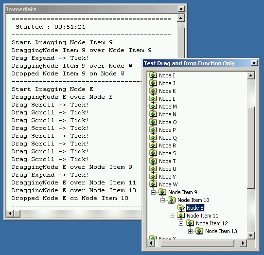



## TreeView Drag'n'Drop

### Description

I get questioned alot about the TreeView control by PSC users - especially about Drag'n'Drop operation. Here is some sample code that directly answers how to do this proceedure including auto-expand of collapsed nodes plus Auto-Scroll during drag.
 
### More Info
 

             |
---                |---
**Submitted On**   |2002-03-26 13:04:10
**By**             |[Slider](https://github.com/Planet-Source-Code/PSCIndex/blob/master/ByAuthor/slider.md)
**Level**          |Intermediate
**User Rating**    |4.2 (42 globes from 10 users)
**Compatibility**  |VB 6\.0
**Category**       |[OLE/ COM/ DCOM/ Active\-X](https://github.com/Planet-Source-Code/PSCIndex/blob/master/ByCategory/ole-com-dcom-active-x__1-29.md)
**World**          |[Visual Basic](https://github.com/Planet-Source-Code/PSCIndex/blob/master/ByWorld/visual-basic.md)
**Archive File**   |[TreeView\_D67751422002\.zip](https://github.com/Planet-Source-Code/slider-treeview-drag-n-drop__1-33336/archive/master.zip)

